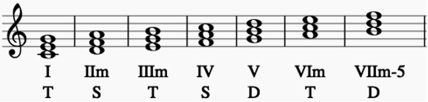
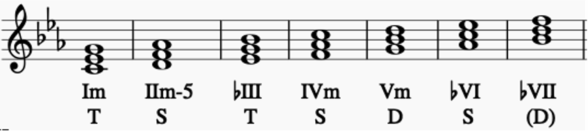

# コード理論

## ダイアトニックトライアド

### 和音機能の種類

|種類|説明|
|-|-|
|トニック(T)|調の特性を決める第三音を含み、アヴォイドノートである第四音を含まないコード。安定感があり、落ち着いたサウンドを持つ。|
|ドミナント(D)|主音へと半音上がって解決しようとする不安定な導音(第七音)を持っているコード。ⅤからⅠへの動きが最も強い解決感が得られるとされている(ドミナントモーション)。|
|サブドミナント(S)|トニック、ドミナントに分類されないコード。アヴォイドノートを持ち、第三音、導音を含まない。|

長調  

短調(自然短音階)  

### カデンツ

終止形の和音進行
|型|進行|
|-|-|
|第1型(K1)|T→D→T|
|第2型(K2)|T→S→D→T|
|第3型(K3)|T→S→T|

### 強進行

コード同士の強い結びつきがある古典的な進行
|種類|進行|
|-|-|
|強進行|四度上行(例:Ⅴ→Ⅰ、Ⅲm→Ⅵm)|
|準強進行|二度上行(例:Ⅳ→Ⅴ)、三度下行(例:Ⅵm→Ⅳ)、四度下行(例:Ⅰ→Ⅴ)|
|弱進行|二度下行(例:Ⅴ→Ⅳ)、三度上行(例:Ⅰ→Ⅲm)、四度下行(例:Ⅴ→Ⅱm)|

※四度下行は基本的に弱進行であるが、Ⅰ→Ⅴ、Ⅳ→Ⅰのみ準強進行とされる

## 定番コード進行

|種類|コード進行|例(Key=C)|
|-|-|-|
|カノン進行|Ⅰ→Ⅴ→Ⅵm→Ⅲm→Ⅳ→Ⅰ→Ⅳ→Ⅴ|C→G→Am→Em→F→C→F→G|
|ベースが下降するカノン進行|Ⅰ→ⅤonⅦ→Ⅵm→ⅠonⅤ→Ⅳ→ⅠonⅢ→Ⅱm→Ⅴ|C→GonB→Am→ConG→F→ConE→Dm→G|
|王道進行|Ⅳ→Ⅴ→Ⅲm→Ⅵm|F→G→Em→Am|
|王道進行の派生形|Ⅱm→Ⅴ→Ⅲm→Ⅵm|Dm→G→Em→Am|
|小室進行|Ⅵm→Ⅳ→Ⅴ→Ⅰ|Am→F→G→C|
|Just The Two of Us進行(丸サ進行)|Ⅳ(M7)→Ⅲ(7)→Ⅵm(7)→Ⅰ(7)|F(M7)→E(7)→Am(7)→C(7)|
|ポップパンク進行1(Let It Be進行)|Ⅰ→Ⅴ→Ⅵm→Ⅳ|C→G→Am→F|
|ポップパンク進行2|Ⅳ→Ⅰ→Ⅴ→Ⅵm|F→C→G→Am|
|ポップパンク進行3|Ⅵm→Ⅳ→Ⅰ→Ⅴ|Am→F→C→G|
|循環進行の代表形(ブルームーン進行)|Ⅰ→Ⅵm→Ⅱm→Ⅴ|C→Am→Dm→G|
|逆循環進行の代表形|Ⅱm→Ⅴ→Ⅰ→Ⅵm|Dm→G→C→Am|

## ノンダイアトニックコード

### セカンダリードミナント

ダイアトニックコードの「Ⅰ」以外のコードに対してドミナントモーションを作る「`Ⅴ7`」のこと

例: Key=C

> C→Am→Dm→G

2コード目のAmに対し、Key=Amとした時のV7(=E7)を直前に加える

> C→**E7**→Am→Dm→G

### リレイテッドⅡm7

セカンダリードミナントコードを「Ⅴ7」とした時に、「`Ⅱm7→Ⅴ7→Ⅰ`」(ツーファイブワン)となるように足す「`Ⅱm7`」のこと

例: Key=C

> C→E7→Am→Dm→G

Key=Amとした時のV7(=E7)に対し、Ⅱm7(=Bm7)を直前に加える

> C→**Bm7**→E7→Am→Dm→G