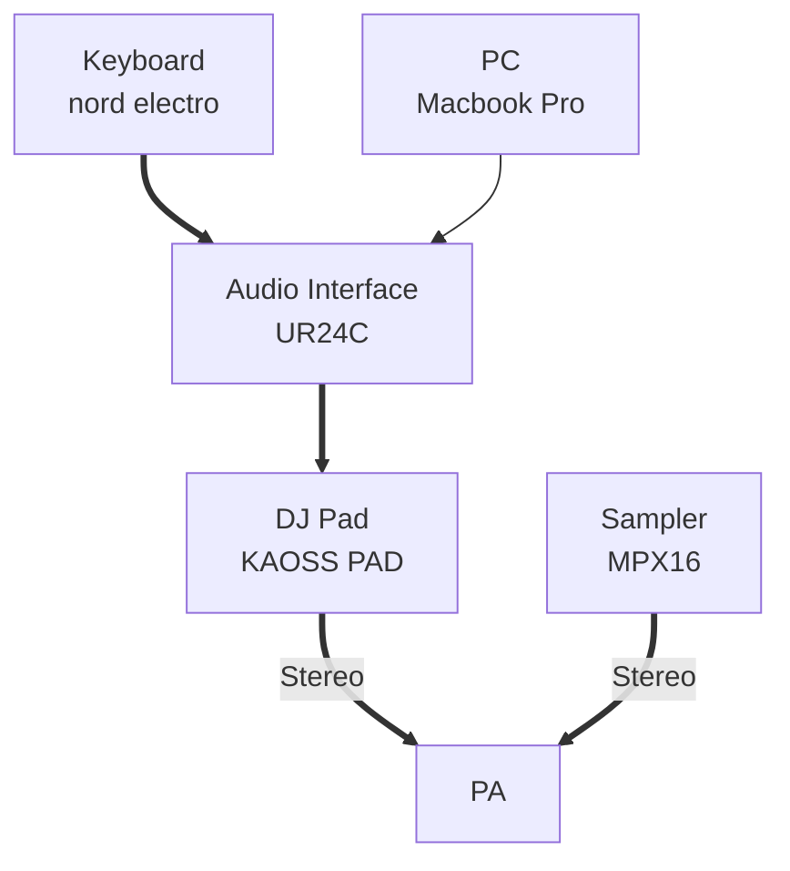
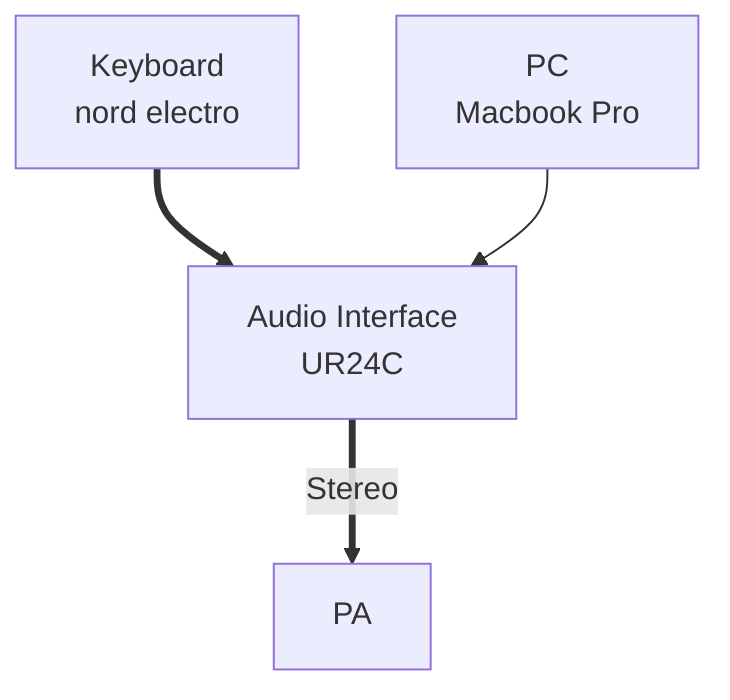

# セット図

```mermaid
flowchart TD
A[PA]
B[Keyboard\nnord electro]
C[PC\nMacbook Pro]
D[Audio Interface\nUR24C]
E[DJ Pad\nKAOSS PAD]
F[Sampler\nMPX16]

B==>D
C-->D
D==>E
E==>|Stereo|A
F==>|Stereo|A
```

---

```mermaid
flowchart TD
A[PA]
B[Keyboard\nnord electro]
C[PC\nMacbook Pro]
D[Audio Interface\nUR24C]

B==>D
C-->D
D==>|Stereo|A
```
